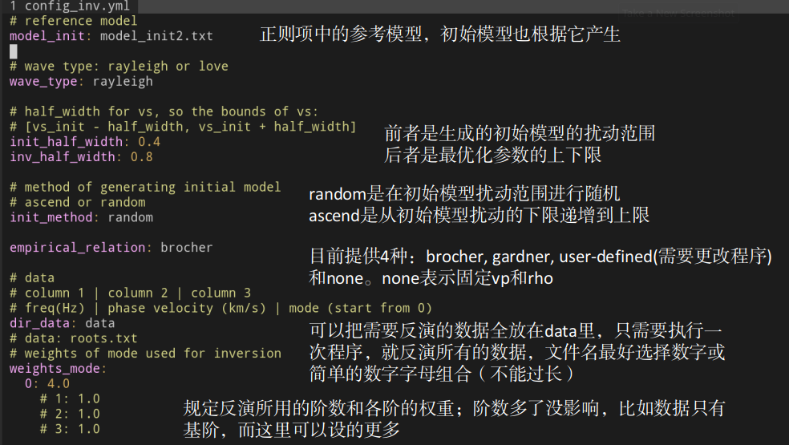
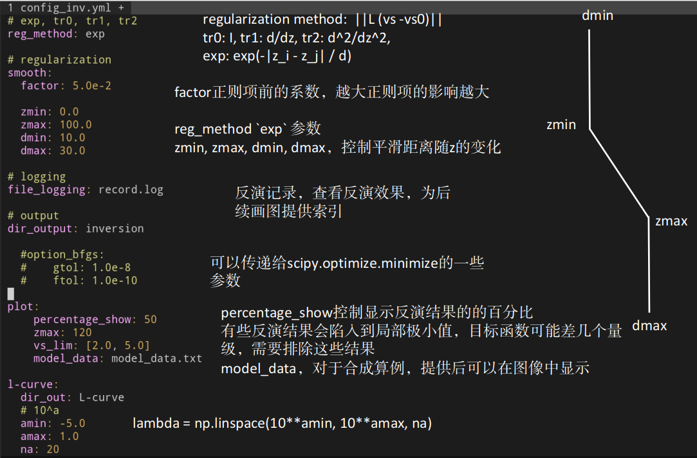

# DisbaTomo
Inversion of multimode dispersion curves of surface wave

The forwarding program is from [disba](https://github.com/keurfonluu/disba), 
which is a computationally efficient Python library for the modeling of 
surface wave dispersion that implements a subset of codes from Computer 
Programs in Seismology (CPS) in Python compiled just-in-time with numba. 

The optimization part is based on python pacakge `scipy.optimize`,
where the gradient is implemented in C++[[1]](#1), and converted into the library 
that can be imported by python with the help of pybind11.


## Installation

There are two circumstances: with sudo permission and without sudo permission.
The prior is typically for PC, and the latter is usually for clusters.

### With sudo permission

1. Install git, [eigen3](https://eigen.tuxfamily.org/index.php?title=Main_Page) and 
[cmake](https://cmake.org/) through the package manager according to the 
system, e.g. apt-get, homebrew, pacman.

2. Make sure your c++ compiler support c++14

3. Install python packages

   1. Install miniconda
        ```bash
        > wget https://mirrors.tuna.tsinghua.edu.cn/anaconda/miniconda/Miniconda3-py38_4.9.2-Linux-x86_64.sh
        > bash ./Miniconda3-py38_4.9.2-Linux-x86_64.sh
        > source .bashrc
        ```
   2. Create environment
        ```bash
        > conda create -n disba python=3.8
        > conda activate disba
        > conda install numpy scipy matplotlib pyyaml mpi4py pandas
        > pip install disba mpi_master_slave
        ```

### Without sudo permission

We use [spack](https://spack.io/) to install required softwares and libraries, which
a package manager for supercomputers, Linux, and macOS. 

1. Install spack
    ```bash
    > git clone https://github.com/spack/spack.git
    > echo ". spack/share/spack/setup-env.sh" >> .bashrc
    > source ~/.bashrc
    ```

2. Install gcc of higher version

    ```bash
    > spack info gcc
    > spack install ${A_VERSION_OF_GCC}
    > spack location -i gcc
    > spack compiler find ${LOCATION_OF_GCC_NEW_VERSION}    
    ```
    ${A_VERSION_OF_GCC} is a version of gcc which you can choose from the list 
    that "spack info gcc" shows, e.g. `gcc@9.3.0`.

    ${LOCATION_OF_GCC_NEW_VERSION} is seen from "spack location -i gcc",
    e.g. `/home/test/spack/opt/spack/linux-centos7-haswell/gcc-4.8.5/gcc-9.3.0-swta24mlro2t4z7rfka55y3aum2ckm32`

3. Install eigen3, git and cmake

    ```bash
    > spack install eigen
    > spack install cmake
    > spack install git
    ```

4. Manage and load package using `lmod`

    ```bash
    > spack install lmod
    > echo ". $(spack location -i lmod)/lmod/lmod/init/bash" >> .bashrc
    > source .bashrc
    > module avail
    ```

5. Load package and software

    ```bash
    > module load ${MODULE_NAME}
    ```
    ${MODULE_NAME} can be found from "module avail", and we need to load
    gcc, cmake, git and eigen3. For my computer, gcc is 
    `gcc-9.3.0-gcc-4.8.5-swta24m`.

    You can add these module load command to your .bashrc or add them
    to the job script submitted to cluster.


6. Install python package (the same procedure as above)

7. Install problems
   
   1. tar (child): lbzip2: cannot exec: no such file or directory

    Solution: 
    ```bash
    > spack install bzip2
    > spack location -i bzip2
    > export PATH=${bzip2 path}:$PATH
    ```
   2. Error: COmmandNotFoundError: spack requires 'patch'
   
    Solutiin:
    ```bash
    > spack install patch
    > spack location -i patch
    > export PATH=${patch path}:$PATH
    ```

### Compilation

After installing requirements, the program is installed in the following.

```bash
> git clone https://github.com/pan3rock/DisbaTomo.git
> cd DisbaTomo
> cd build
> cmake ..
> make -j4
```

## Usage

### Determine L-curve
```bash
> cd .. # in {DisbaTomo/}
> mkdir examples
> cp -r demo/* examples/
> cd examples/regular-large
> mpirun -np 4 ../../python/determine_lcurve.py
> ../../python/plot_lcurve.py 0
```

### Inversion
```bash
> mpirun -np 4 ../../python/inversion.py --num_init 20
> ../../python/plot_inversion.py --data 0 --plot_model --plot_init
> ../../python/plot_inversion.py --data 0 --plot_model
> ../../python/plot_inversion.py --data 0 --plot_disp
```

### Plot sensitivity kernel

The sensitivity is defined in [[1]](#1).
```bash
> ../../python/forward.py --data data/0.txt
> ../../python/plot_disp.py disp.txt
> ../../python/plot_kernel.py model_output.txt --disp disp.txt --mode 0 --plot_dispersion
> ../../python/plot_kernel.py model_output.txt --disp disp.txt --mode 1 --plot_dispersion
> ../../python/plot_kernel.py model_output.txt --disp disp.txt --mode 2 --plot_dispersion
> ../../python/plot_kernel.py model_output.txt --disp disp.txt --mode 3 --plot_dispersion
```

### Configure file

TODO: translate into English





Brocher and Gardner empirical relation have been provided, and you can add other
formula in `python/empirical_relation.py`.


## References

<a id="1">[1]</a>
Pan, L., Chen, X., Wang, J., Yang, Z., & Zhang, D. (2019). Sensitivity analysis of dispersion curves of Rayleigh waves with fundamental and higher modes. Geophysical Journal International, 216(2), 1276–1303. https://doi.org/10.1093/gji/ggy479

